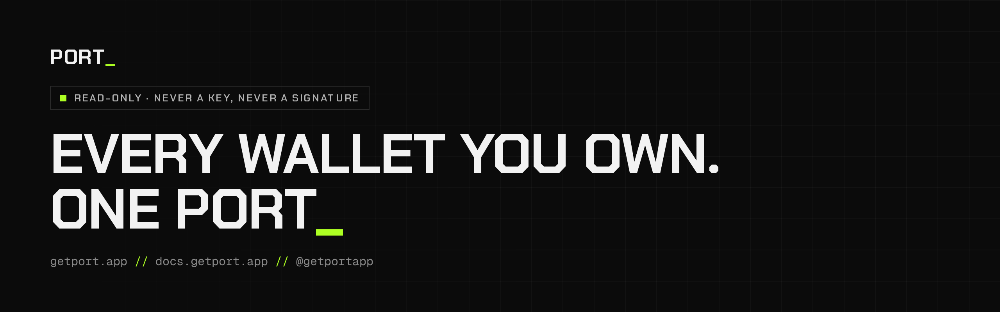

<a href="https://getport.app"></a>

<p align="center">
  <a href="https://getport.app"><b>Open Port_</b></a> ·
  <a href="https://docs.getport.app">Docs</a> ·
  <a href="https://docs.getport.app/build-with-ai/">Build with AI</a> ·
  <a href="https://x.com/getportapp">X</a> ·
  <a href="https://t.me/getportappdotcom">Telegram</a>
</p>

**Port_** is a read-only crypto portfolio tracker for people with a lot of wallets. Paste an
address and see everything it holds, across Solana, the EVM chains, Hyperliquid and more: tokens, DeFi,
perps, prediction markets and NFTs, with PnL and cost basis on top.

The numbers are honest on purpose. Every price carries where it came from and how deep the market
behind it is, and one we cannot stand behind is shown on its row, labelled, and left out of your
total. We never hold a private key, a seed phrase or your funds, and we cannot sign anything.

### Connect your AI

One command connects Claude Code, Codex, Cursor and every other coding agent on your computer:

```sh
npx add-mcp@2.4.0 https://getport.app/mcp --name port -g
```

The first time it is used, it opens getport.app: sign in, press Allow, done. No key to paste.
In claude.ai, Claude Desktop or ChatGPT, add a custom connector with `https://getport.app/mcp`.
It reads your own port and nothing else, and Disconnect in Settings stops it on its next call.
[How AI access is kept safe](https://docs.getport.app/security/ai-access/).

### Repositories

| Repository | What it is |
| --- | --- |
| [skills](https://github.com/getport/skills) | Agent skills and the Claude Code and Codex plugin for the Port_ API and MCP server |

Found a security problem? Write to privacy@getport.app
([security.txt](https://getport.app/.well-known/security.txt)).
